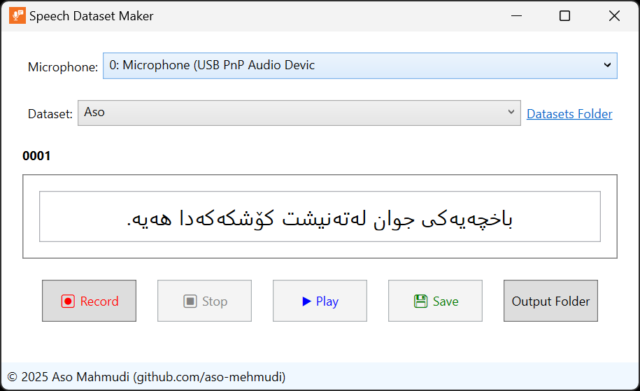

# Speech Dataset Maker
Speech Dataset Maker is a Windows application designed to simplify the creation of high-quality speech datasets for training Text-to-Speech (TTS) models. It is especially convenient for directly preparing datasets in Piper format.

## Features
- **User-Friendly Interface**: Intuitive GUI for easy dataset creation.
- **Direct Export for TTS**: Export recordings directly in Piper format without a separate export step.
- **Multiple Dataset Support**: Define different datasets with different sentences and technical settings.
- **Automatic Silence Trimming**: Automatically removes silence at the beginning and end of recordings.
- **Unicode & RTL/LTR Support**: Works with any language, including right-to-left scripts.
- **Editable Metadata**: Edit the text before saving to the metadata file.

## Installation
1. Download the setup file from the Releases page.
1. Install the application.
1. Ensure .NET 8.0+ Runtime is installed on your system.

## Requirements
- Windows operating system
- .NET 8.0+ Runtime

## Usage
To start recording each dataset you need:  
- a `.json` file for configurations  
- a `.tsv` file with ID–sentence pairs  

You can add or edit these files in the `dataset` folder of the application. A link to that folder is provided in the interface.

1. Select the desired microphone from the list of available devices.  
2. Select the dataset in the interface.  
3. Unrecorded sentences will appear in the text box — you can edit them before recording.  
4. When ready, click **Record** and read the sentence aloud.  
5. Use the **Play** button to check your recording.  
6. If satisfied, click **Save**. The next sentence will appear.  
   - The app automatically trims silence and updates metadata.  
   - Recordings are directly stored in *Piper format*, ready for TTS training.  
7. Click **Output Folder** to view the dataset at any stage.

## Acknowledgments
Ideas and inspiration for this project were adapted from [Piper Recording Studio](https://github.com/rhasspy/piper-recording-studio/).

## License
This project is licensed under the MIT License. See the LICENSE file for details.
